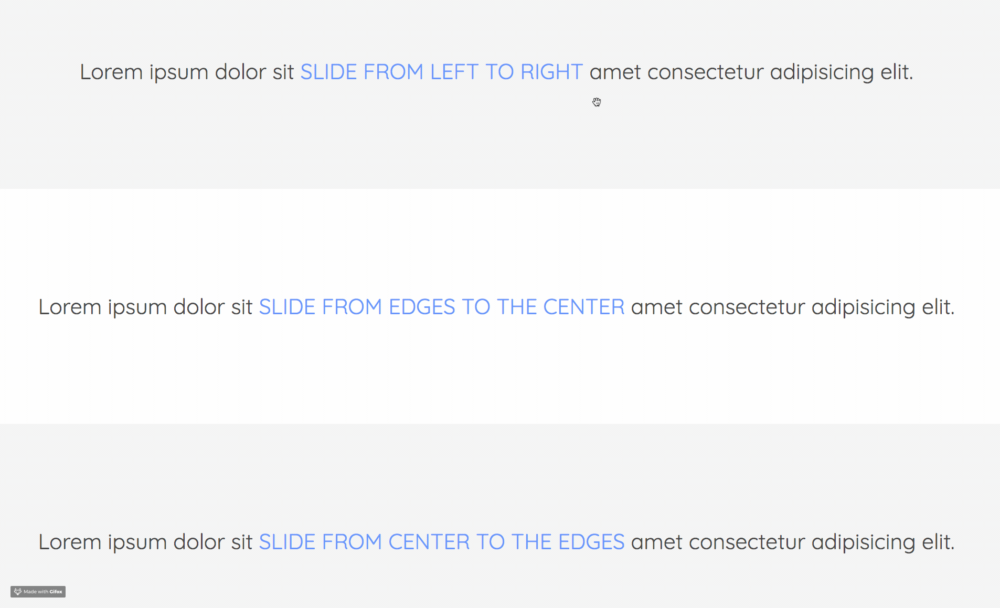

# Animations

Smooth CSS3 animations appearing from different directions.

---

## Setup

1. Clone or download repository.
2. Open `index.html` file using local or file server.

---

### Use case

- 3 types of animations: 
    1. slide from left to right
    2. slide from edges to the center
    3. slide from center to the edges
- Using plain vanilla HTML & CSS
- Positioning elements with a help of **Flexbox**
- Improving typography with **Google Fonts**

---

*Made for students of UJEP (Univerzita Jana Evangelisty Purkyně) in Ústí nad Labem who are specializing in computer science degree.*
